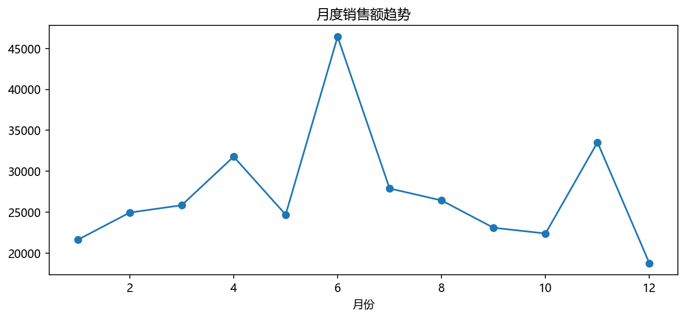
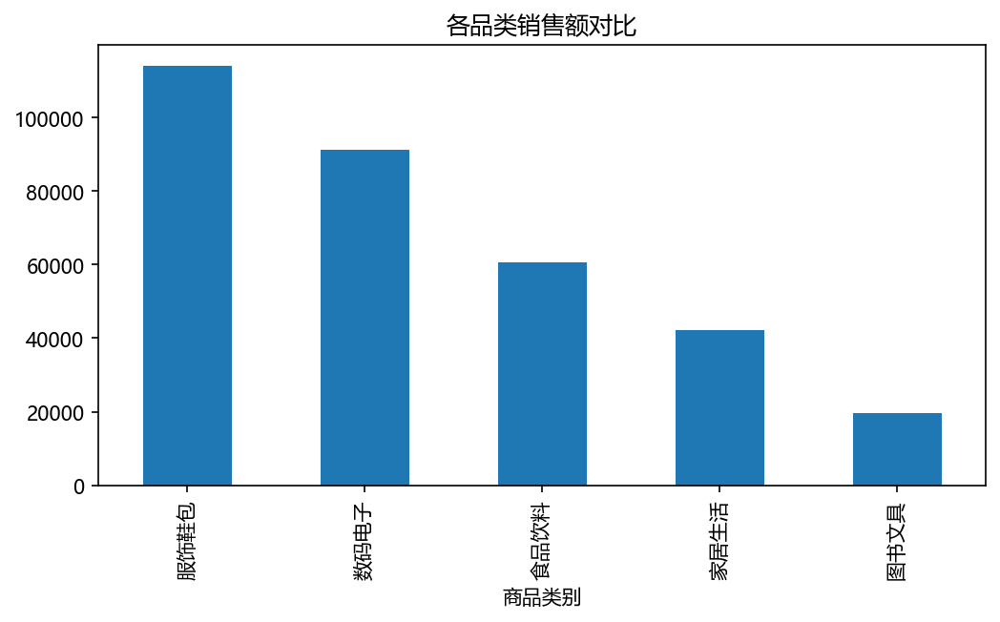
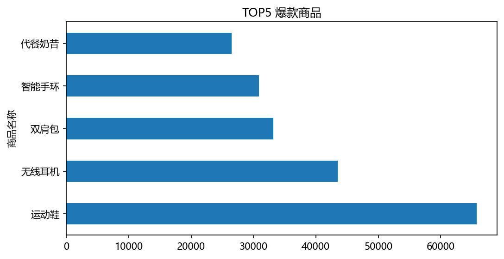
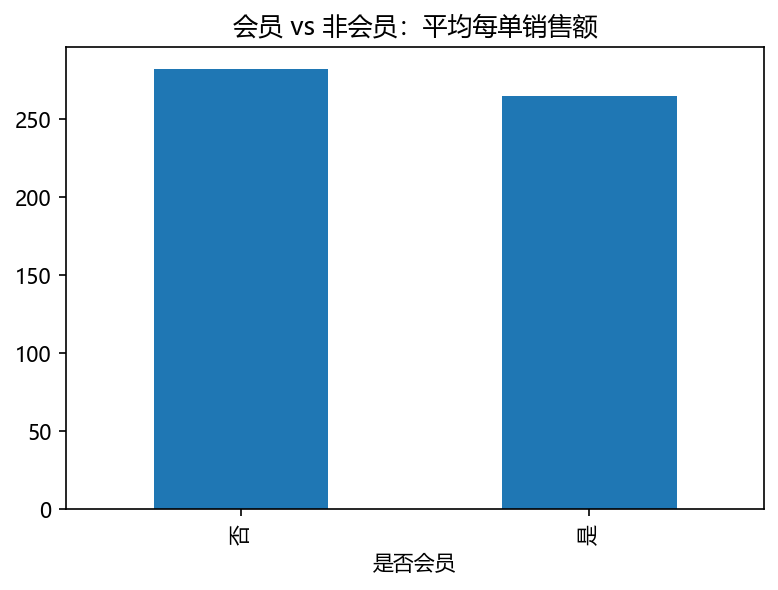
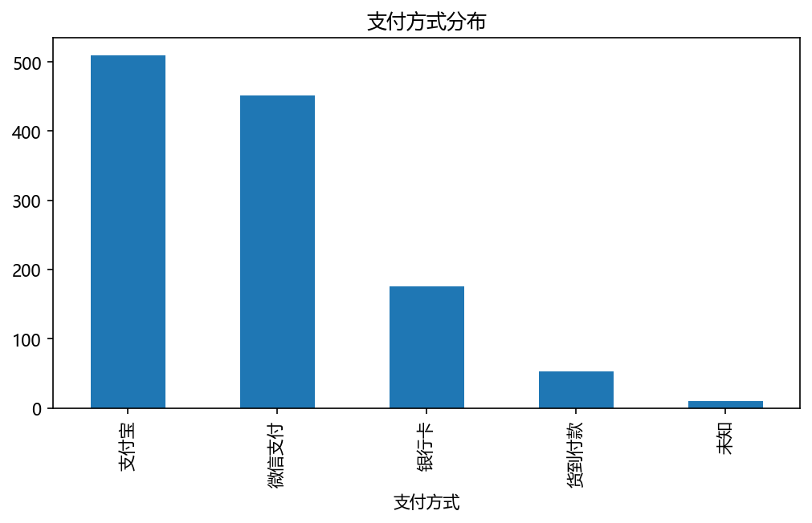

# 电商销售数据分析

## 项目简介
在Ai工具WorkBuddy指导下独立完成分析了一个学年约 1200 条电商订单，回答了趋势/品类/爆款/会员/支付 5 个业务问题

## 数据说明
- 时间范围：2025-09 至 2026-08（一个完整学年）
- 原始数据 1225 条，清洗后 1200 条
- 原始数据故意包含缺失、重复、异常等脏数据，清洗过程全部记录在 Notebook 中

## 清洗流程（共修复 6 类问题）
1. 去重：drop_duplicates 删除 25 条完全重复订单
2. 销售额缺失 21 条：用 单价 × 数量 计算恢复
3. 支付方式缺失 10 条：如实标注"未知"
4. 数量异常 5 条（负数）：用 销售额 ÷ 单价 修复
5. 商品名首尾空格 8 条：str.strip 清理
6. 下单日期：object 文本 → datetime64 日期类型

## 关键结论
1. 月度趋势：6 月（约 4.7 万）和 11 月（约 3.3 万）双峰，对应 618/双11 大促；12 月最低
2. 品类结构：营收冠军是服饰鞋包类，前两大品类合计约占全店 62%
3. 爆款商品：TOP1 是运动鞋，全年约 65784.8 元；其中最大单笔 2130.8 元（7 双运动鞋）约占 3.2%，经自查该品类由大量正常订单支撑（共 80 单），并非单笔大单虚高
4. 会员洞察：会员下单更多但平均每单均价低；由于"是否会员"字段与消费无因果关系（模拟数据随机生成），策略上应拉高会员客单价
5. 支付方式：支付宝+微信合计约80%，货到付款仅 53 单正在消亡

## 图表

## 技术栈
Python 3.13 / pandas 2.3 / matplotlib / Jupyter Notebook

## 我的收获
这是我第一次进行数据分析相关流程操作，通过ai工具的帮助我从网上获取了一份脏数据并进行了分析和学习,亲手修复了 69 处脏数据，在分析过程中我了解到了数据分析师工作以及数据分析的重要性，
也知道了数据分析过程中的严谨性，宁可少说也不能乱说，很多坑不单单看表面数据就能妄下结论，很多数据也能反馈我们一些营销策略
